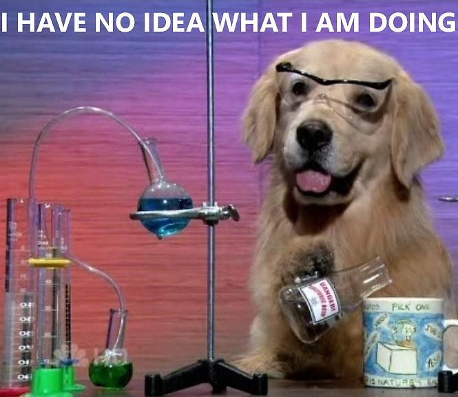

slidenumbers: true
slidecount: true

[.slidenumbers: false]
# Testing
## Neumodischer Kram?

^ Kleiner Geschichtsunterricht, da es wo viel Wissen gibt, das irgendwie nicht weiter getragen wurde…

---

[.slidenumbers: false]
# TDD by Example
## November 2002, Kent Beck

---

# TDD by Example
## "Red - Green - Refactor"

Design-Prinzip: Keine Zeile Produktivcode ohne fehlschlagenden Test!  
(~20 Jahre alt)

---

[.slidenumbers: false]
# `awk`
## Erstveröffentlichung 1977

---

[.slidenumbers: false]
> Any of the three of us who put in a new feature … first had to write a test for the new feature.
— [Alfred V. Aho](http://www2.computerworld.com.au/article/216844/)

---

# `awk`
## Alfred Aho, Peter Weinberger, Brian Kerningham

Design-Prinzip: Keine Zeile Produktivcode ohne fehlschlagenden Test!  
(~40 Jahre alt)

---

[.slidenumbers: false]
# Wasserfallmodell
## irgendwann 1970

---

# Wasserfallmodell
## Winston W. Royce

- Definition einer Designphase mit Testdefinition
- Planung, Messung und Überwachung des Tests

^ Erweitert ein älteres Konzept

---

# Wasserfallmodell
## Winston W. Royce

Testing als Design-Prinzip
(~50 Jahre alt)

---

[.slidenumbers: false]
# SOFTWARE ENGINEERING Conference
## 07. – 11. Oktober 1968

^ Sponsored by NATO SCIENCE COMMITTEE
Dazugehöriger Report ist absolut lesenswert!

---

[.slidenumbers: false]
> A software system can best be **designed** if the testing is **interlaced** with the designing instead of being used after the design.
— Alan Perlis

---

# SOFTWARE ENGINEERING

Testing als Design-Prinzip  
(~53 Jahre alt)

^ NASA machte das mutmaßlich schon vorher, auch wenn Assembler Kommentare wie "I really hope, hope, hope" das Gegenteil vermuten lassen. Sie konnten schlicht nicht alles testen.

---

[.slidenumbers: false]

# Physikalische Hardwaretests
## [10. September 1959](https://www.welt.de/motor/article4489160/Beim-ersten-Crashtest-gab-es-fast-einen-Toten.html)

^ Erster dokumentierter KFZ Unfalltest, bei dem der Fahrer beinahe ums Leben kam 
Bild: The Incredible Crash Dummies ~1991

---

# Physikalische Hardwaretests
## Unfalltest

Testing als Design-Prinzip  
(~62 Jahre alt)

---

[.slidenumbers: false]
# Symposium on advanced programming methods for digital computers
## 29. Juni 1956

---

# Symposium on advanced…
## Herbert D. Benington

Vorgänger zum Wasserfallmodell  
Testing zur Qualitätssicherung  
(~65 Jahre alt)

^ Gut und schön, aber alles nur wahnwitzige Ideen Einzelner!

---

# Fazit

Dieser **neumodische Kram** hat über **65 Jahre** auf dem Buckel.  
Doch sind es nur Hirngespinste einzelner verwirrter Perfektionisten…  

^ Zeit für Standards!

---

[.slidenumbers: false]
# ISO/IEC/IEEE 29119
## Teil 1 bis 3 vom 1. September 2013

^ ISO = International Standardization Organization
! ISSo = Ich Schrei Sonst

---

[.build-lists: true]
# ISO-29119
## Internationale Ablöse

- BS 7925 (Testtechniken), 31. Oktober 2000
- IEEE 1008 (Unit Testing), 11. Dezember 1986
- IEEE 829 (Test Documentation), 03. Dezember 1982

^ Ich will nicht sagen, dass dieser Standard bei Testmanagern beliebt ist. Ist er nicht. Aber er existiert.
IEEE = Institute of Electrical and Electronics Engineers

---

[.build-lists: true]
# Testtechniken
## Übergeordnete Gruppen

- Akzeptanztests
- Regressionstests
- Explorative Tests

^ Erklärst Du en detail auf den nächsten Folien

---

# Akzeptanztests
## Prüft die erfolgreiche Umsetzung

Was immer wir hier haben, soll bitte der Spezifikation entsprechen.

^ Mr. Aho's `awk` Feature Tests

---

# Regressionstests
## Prüft bestehende Funktionalität

Fuck, da ham wa was kap0r7 gemacht.  
Das hätte so nicht passieren dürfen.

^ Ursache, die Mr Aho zu den seltsamen Featuretests animiert hat

---

# Explorative Tests
## The fun part

Mit allen möglichen und unmöglichen Mitteln versuchen, die Software kaputt zu bekommen.

---

# Testrecycling
## App Version 1.0.0

- A,B,C,D // Akzeptanz
- 0,1,2,3 // Explorativ

---

# Testrecycling
## App Version 1.0.1

- E
- 0,1,4,5
- A,B,C,D // Regression

---

# Testrecycling
## App Version 1.1.0

- F,G,H
- 0,4,6,7,8,9
- A,B,C,D,E

^ Nächstes Release 8 Regressionstests (A—H)
Überblick behalten wird schwierig

---

[.slidenumbers: false]

# Automate **ALL THE** Tests!
## Manuell kostet Zeit und bindet Personal

---

[.slidenumbers: false]

# Automate **ALL THE** Tests?
## Explorativ lässt sich (noch) nicht automatisieren

^ So genannte Monkey Tests sind nicht dasselbe

---

[.build-lists: true]
# Zu automatisierende Tests

- Akzeptanztests
- die werden von ganz allein zu Regressionstests

^ Durch die Automatisierung werden sie automatisch zu Regressionstests

---

[.slidenumbers: false]
# Testanatomie
## Given…, When…, Then…

---

# Testanatomie
## Alternative Bezeichner

- Precondition, Execution, Postcondition
- Prepare, Run, Validate
- Planung, Durchführung, Auswertung

---

[.slidenumbers: false]

# Prinzipiell ein wissenschaftliches Experiment

---

[.slidenumbers: false]


## mit allem, was dazu gehört… 

^ Das scheint mir auch der Grundsatz Vieler, wenn ich mir die Testing-/Mocking-/Dependency Injection Frameworks so ansehe

---

# Given…

Alle zur Durchführung des Tests notwendigen Dinge werden vorbereitet.

- Kennwörter raussuchen
- Benötigte Server starten
- Konfigurationen laden

^ Dateisystem vorbereiten, diesdas

---

# When…

Durchführung des Tests

- Funktionsaufruf
- Objekt erstellen und manipulieren
- Kompletter Integrationslauf

---

# Then…

Abgleich der Testergebnisse mit der Erwartungshaltung.

- Ausgaben in Logs bzw. der Konsole
- Anpassungen am Dateisystem
- gesendete Serveranfragen

---

[.slidenumbers: false]
# `Coding Time`

---

```golang
package slides

import "testing"

func TestAllTheThings(t *testing.T) {
	given := 23
	want := 42
	if got := sut(given); got != want {
		t.Errorf("%q: sut(%d): got %d; want %d", 
				t.Name(), given, got, want)
	}
}
```

^ sut steht für System Under Test
Viel einfacher geht es nicht…

---

```golang
package slides

import "fmt"

func ExampleAllTheThings() {
	fmt.Println(sut(23))
	// Output: 42
}
```

- Landet in der Dokumentation: `godoc -http=:PORT`
- Infos: [https://go.dev/blog/examples](https://go.dev/blog/examples)

^ Einfacher geht es nun aber wirklich nicht

---

[.slidenumbers: false]
# `Live Coding Time`
## Optional

---

[.slidenumbers: false]
# Fragen, Ergänzungen, Anregungen

---

[.slidenumbers: false]
# That's All Folks
## "Tschüss!"
